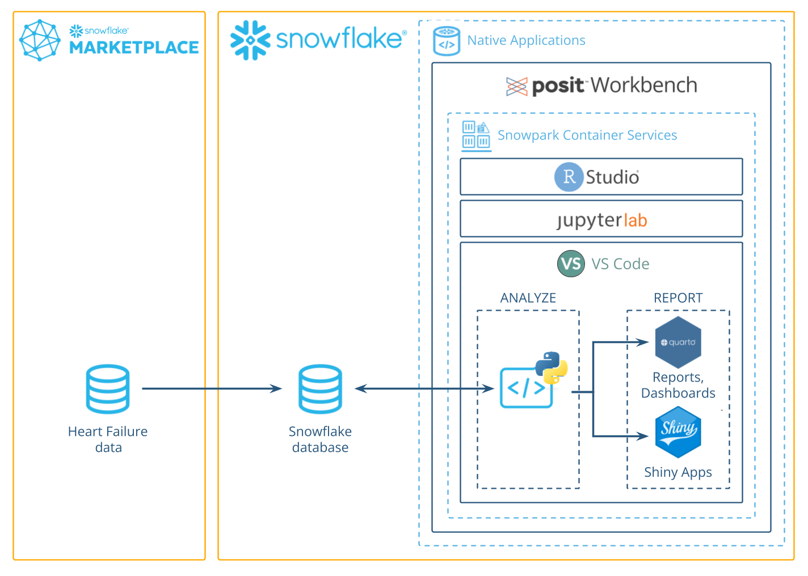
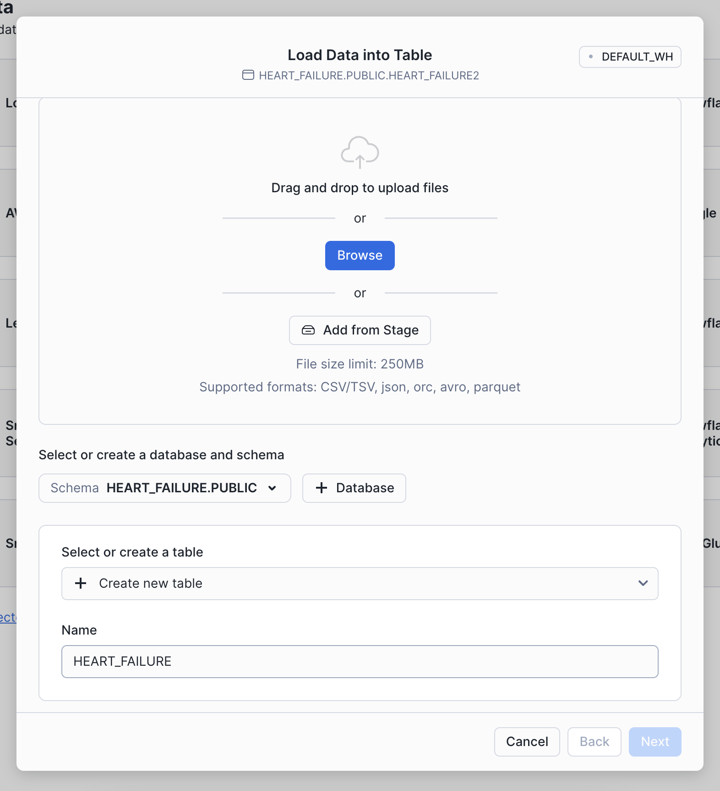
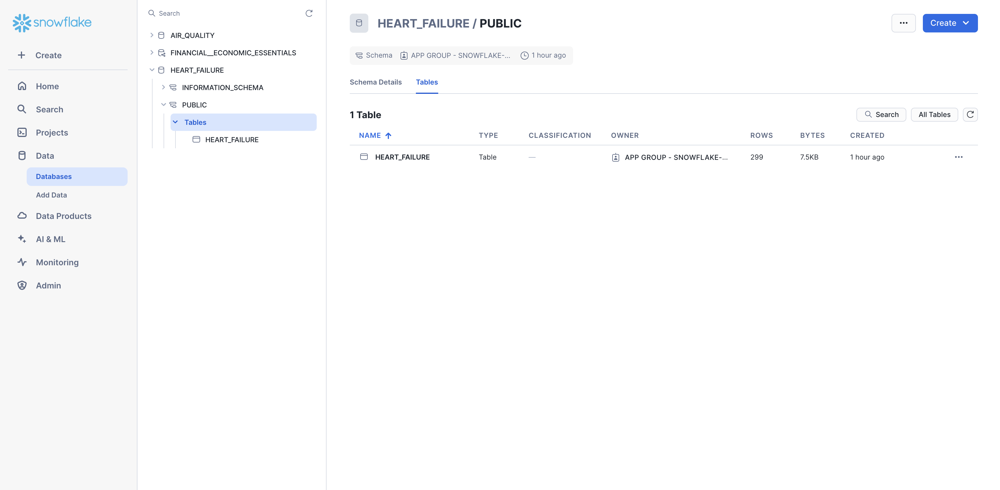
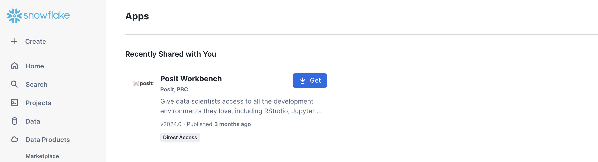
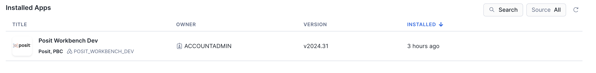
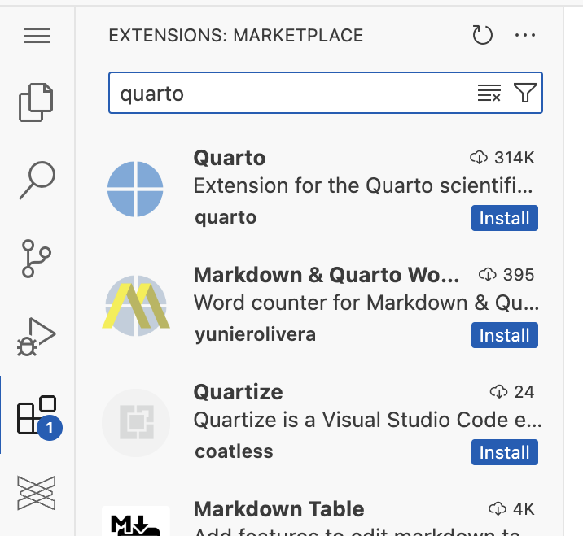
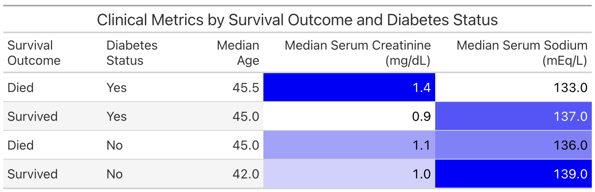
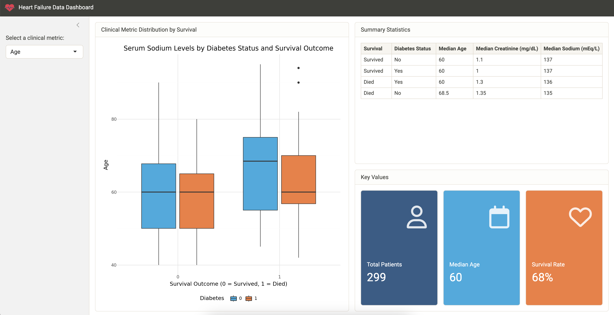

author: Daniel Chen, Sara Altman
id: analyze_data_with_python_using_posit_workbench_and_snowflake
summary: Analyze Data with R using Posit Workbench and Snowflake
categories: Getting-Started
environments: web
status: Published
feedback link: https://github.com/Snowflake-Labs/sfguides/issues
tags: Getting Started, Data Science, R, Posit Workbench, Native Applications

#  Analyze Data with Python using Posit Workbench and Snowflake

## Overview
Duration: 1

This guide will walk you through using Python to analyze data in Snowflake using the Posit
Workbench Native App. You'll learn how to launch the Posit Workbench Native App and use the available VS Code IDE. You'll also learn how to use the `{ibis}` library to translate Python code into SQL, allowing you to run data operations directly in Snowflake's high-performance computing environment.

We'll focus on a healthcare example by analyzing heart failure data. We'll then guide you through accessing the data, and performing data cleaning, transformation, and visualization. Finally, you'll see how to generate an HTML report, build an interactive Shiny app, and write data back to Snowflake—-completing an end-to-end analysis in Python _entirely within Snowflake_.



### What You'll Need

- Familiarity with Python
- The ability to launch Posit Workbench from [Snowflake Native Applications](https://docs.posit.co/ide/server-pro/integration/snowflake/native-app/). This can be provided by an administrator with the `accountadmin` role.

### What You’ll Learn

- How to work in VS Code from Posit Workbench Native App.
- How to connect to your Snowflake data from Python to create tables, visualizations, and more.

### What You’ll Build

- A VS Code environment to use within Snowflake.
- A Quarto document that contains plots and tables built with Python, using data stored in Snowflake.
- An interactive Shiny for Python application built using data stored in Snowflake.

Along the way, you will use Python to analyze which variables are associated with survival among patients with heart failure.
You can follow along with this quickstart guide,
or look at the materials provided in the accompanying repository:
<https://github.com/posit-dev/snowflake-posit-quickstart-python>.

## Setup
Duration: 3

Before we begin there are a few components we need to prepare. We need to:

- Add the heart failure data to Snowflake
- Launch the Posit Workbench Native App
- Create a VS Code session
- Create a virtual environment and install the necessary libraries

### Add the heart failure data to Snowflake

For this analysis, we'll use the [Heart Failure Clinical Records](https://archive.ics.uci.edu/dataset/519/heart+failure+clinical+records) dataset. The data is available for download as a CSV from the [UCI Machine Learning Repository](https://archive.ics.uci.edu/dataset/519/heart+failure+clinical+records). 

We'll walk through how to download the data from UCI and then upload it to Snowflake from a CSV.

> **_INTERACTIVITY NOTE:_** If you have the necessary permissions in Snowflake, you can also import the data from this S3 bucket: s3://heart-failure-records/heart_failure.csv.

#### Step 1: Download the data as a CSV

Download the data from UCI [here](https://archive.ics.uci.edu/dataset/519/heart+failure+clinical+records), and then unzip the downloaded file. 

#### Step 2: Add data in Snowsight

Log into [Snowsight](https://docs.snowflake.com/en/user-guide/ui-snowsight), then click `Create` > `Add Data`. You can find the `Create` button in the upper-left corner. 


#### Step 3: Load data

Choose the `Load Data into a Table` option, then select your downloaded heart failure CSV. Specify an existing database or create a new one for the heart failure data (we called ours `HEART_FAILURE`). Then, select `+ Create a new table` and name it `HEART_FAILURE`.

Once your find the database, you can load it into your Snowflake account by clicking the Get button on the right-hand side.



#### Step 4: Confirm data

You should now be able to see the heart failure data in Snowsight. Navigate to `Data` > `Databases`, then select the database to which you added the data (e.g., `HEART_FAILURE`). Expand the database, schema, and tables until you see the `HEART_FAILURE` table. 



### Launch Posit Workbench

We can now start exploring the data using Posit Workbench.
You can find Posit Workbench as a Snowflake Native Application
and use it to connect to your database.

#### Step 1: Navigate to Apps

In your Snowflake account, Go to `Data Products` > `Apps` to open the Native Apps collection. If Posit Workbench is not already installed, click `Get`. Please note that the Native App must be [installed and configured ](https://docs.posit.co/ide/server-pro/integration/snowflake/native-app/install.html)by an administrator. 



#### Step 2: Open the Posit Workbench Native App

Once Posit Workbench is installed, click on the app under `Installed Apps` to launch the app. If you do not see the Posit Workbench app listed, ask your Snowflake account administrator for access to the app.



After clicking on the app, you will see a page with configuration instructions and a blue `Launch app` button.


Click on `Launch app`. This should take you to the webpage generated for the Workbench application. You may be prompted to first login to Snowflake using your regular credentials or authentication method.

### Create a VS Code Session 

Posit Workbench provides several IDEs, including VS Code, RStudio Pro, and JupyterLab. For this analysis we will use VS Code.

#### Step 1: New Session

Within Posit Workbench, click `New Session` to launch a new session to spin up your coding environment.


#### Step 2: Select an IDE

When prompted, select VS Code.


#### Step 3: Log into your Snowflake account

Next, connect to your Snowflake account from within Posit Workbench.
Under `Credentials`, click the button with the Snowflake icon to sign in to Snowflake.
Follow the sign in prompts.


When you're successfully signed into Snowflake, the Snowflake button will turn blue
and there will be a checkmark in the upper-left corner.


#### Step 4: Launch VS Code

Click `Start Session` to launch VS Code.

Once everything is ready,
you will be able to work with your Snowflake data
in VS Code. Since the IDE is provided by the Posit Workbench Native App, 
your entire analysis will occur securely within Snowflake.


#### Step 5: Install Quarto and Shiny Extensions

The Quarto and Shiny VS Code Extensions support the development 
of Quarto documents and Shiny apps in VS Code. The Jupyter extension provides 
support for running Python code in notebook cell.s

Install these extensions by:

1. **Open the VS Code Extensions view.** On the right-hand side of VS Code, click
the Extensions icon in the Activity bar to open the Extensions view.
2. **Search for "Quarto"** to find the Quarto extension. 



3. **Install the Quarto extension.** Click on the Quarto extension, then click `Install`.
4. **Install the Shiny extension.** Search for the Shiny extension, then install 
the extension in the same way. 
4. **Install the Jupyter extension.** Search for the Jupyter extension, then install 
the extension in the same way. 

You can learn more about these extensions here: [Shiny extension](https://shiny.posit.co/blog/posts/shiny-vscode-1.0.0/), 
[Quarto extension](https://quarto.org/docs/tools/vscode.html).

#### Step 6: Access the Quickstart Materials

This Quickstart will step you through the analysis contained in <https://github.com/posit-dev/snowflake-posit-quickstart-python/blob/main/quarto.qmd>.
To follow along, clone the GitHub repo by:

    1.  Click `Clone Repository`.

    

    2.  Paste the [URL](https://github.com/posit-dev/snowflake-posit-quickstart-python/)
    of the GitHub URL into the Command Palette.
    
    3. Click `Clone from URL`.

    

    3. Choose a folder to clone the repo into.

    
    
    4. Follow the prompts to authenticate to GitHub.
    
    5. When prompted, click `Open` to open the cloned repository.
    
    
    
    6. Open `quarto.qmd`.
    
### Create a virtual environment

Create a virtual environment and install dependencies from `requirements.txt`.
See [Creating Environments](https://code.visualstudio.com/docs/python/environments#_creating-environments) 
for more details. 

<!-- fill in steps -->

## Access Snowflake data from Python
Duration: 5

We will run our code in our Python environment, but the code will use data stored in our database on Snowflake.

To access this data, we'll use the Ibis library to connect to the database and
querty the data from Python, without having to write raw SQL. 
Let's take a look at how this works.

### Connect with Ibis

[Ibis](https://ibis-project.org/) is an open source dataframe library that works with a wide variety of backends, 
including Snowflake.

Import `ibis`, then use `ibis.snowflake.connect` to connect to our Snowflake 
database. We need to provide a `warehouse` for compute and a `database` to connect to.
We can also provide a `schema` here to make connecting to specific tables easier.

```python
import ibis 

con = ibis.snowflake.connect(
  warehouse="DEFAULT_WH",  
  database="HEART_FAILURE",  
  schema="PUBLIC",
  connection_name="workbench"
)
```

> **_INTERACTIVITY NOTE:_** Your `warehouse`, `database`, `catalog` values may differ,
depending on your available warehouses and how you named your database.  

The variable `con` now stores our connection. 

### Create a table that corresponds to a table in the database

Once we build a connection, we can use `table()` to create a [table](https://ibis-project.org/reference/expression-tables#:~:text=A%20table%20expression%20contains%20an,new%20Table%20with%20those%20changes) that represents the database table.

```python
heart_failure = con.table("HEART_FAILURE")
```

### Rely on Ibis to translate Python to SQL

We can now use Ibis to interact with `heart_failure`. For example, 
we can filter rows and select columns from our data.

```python
heart_failure_filtered = (
    heart_failure.filter(heart_failure.AGE < 50)  # Filter to age < 50
    .rename(
        age="AGE",
        diabetes="DIABETES",
        serum_sodium="SERUM_SODIUM",
        serum_creatinine="SERUM_CREATININE",
        sex="SEX",
        death_event="DEATH_EVENT",
    )
    .select(
        ["age", "diabetes", "serum_sodium", "serum_creatinine", "sex", "death_event"]
    )
)
```

Right now, `heart_failure_filtered` is what Ibis calls a [table expression](https://ibis-project.org/reference/expression-tables). 
Ibis lazily evaluates commands, which means that the full query is never run on 
the database unless explicitly requested.

You can force Ibis to compile the table expression into SQL and run that SQL on
Snowflake with `.execute()` or `.to_pandas()`. 

```python
heart_failure_filtered.execute()
```

### In summary

This system:

1. Keeps our data in the database, saving memory in the Python session
2. Pushes computations to the database, saving compute in the Python session
3. Evaluates queries lazily, saving compute in the database

We don't need to manage the process, it happens automatically behind the scenes.

Learn more about Ibis at [https://ibis-project.org/](https://ibis-project.org/). 
You can learn more about the Snowflake backend specifically at [https://ibis-project.org/backends/snowflake](https://ibis-project.org/backends/snowflake).

## Write to a Snowflake database
Duration: 1

You can also use Ibis to create a new table in a database or append to an existing table.

To add a new table, use `create_table()`.

```python
con.create_table("HEART_FAILURE_FILTERED", heart_failure_filtered)
```

To insert data into an existing table, use [`insert()`](https://ibis-project.org/backends/snowflake#ibis.backends.snowflake.Backend.insert). 

Now that we understand how to interact with our database, we can use Python to perform our analysis.

## Prepare data with `{dplyr}`
Duration: 5

We want to understand which variables in `HEART_FAILURE` are associated with survival
of patients with heart failure.

First we convert the column names to lowercase, so we won't need to worry about capitalization.

```r
# Standardize column names
heart_failure <- 
  heart_failure |> 
  rename_with(str_to_lower)
```

> When we are running these commands on a database connection, `{dbplyr}` is translating the code into SQL for us under the hood.
> We don't need to write raw SQL commands, and the compute is happening directly on the database.
> You can pipe `|>` the code into `show_query()` if you want to see the generated SQL query.


### Filter ages

For now, we'll focus on just patients younger than 50. We also reduce the data to just the columns we're interested in.

```r
heart_failure <-
  heart_failure |> 
  filter(age < 50) |> 
  select(age, diabetes, serum_sodium, serum_creatinine, sex, death_event)
```

Our table now looks like this.

```
# Source:   SQL [?? x 6]
# Database: Snowflake 8.39.2[@Snowflake/HEART_FAILURE]
     age diabetes serum_sodium serum_creatinine   sex death_event
   <dbl>    <dbl>        <dbl>            <dbl> <dbl>       <dbl>
 1    45        0          137             1.1      1           1
 2    49        0          138             1        0           0
 3    45        0          127             0.8      1           1
 4    48        1          121             1.9      0           1
 5    49        0          136             1.1      1           1
 6    45        1          139             1        1           1
 7    45        0          145             1        1           1
 8    45        0          137             1.18     0           0
 9    42        1          136             1.3      0           1
10    41        0          140             0.8      1           0
# ℹ more rows
# ℹ Use `print(n = ...)` to see more rows
```

## Visualize Data with `{ggplot2}`
Duration: 5

The heart failure data provides important insights that can help us:

- Identify factors associated with increased risk of mortality after heart failure
- Predict future survival outcomes based on historical clinical data
- Benchmark patient outcomes based on clinical indicators like serum sodium levels

Visualizing clinical variables across different patient groups can help identify patterns.

### Visualize serum sodium levels

We can use `{ggplot2}` to visually compare sodium levels across different patient groups. In this plot, we see the distribution of serum sodium based on whether the patients have diabetes and whether they survived (`0`) or died (`1`) during the follow-up period.

```r
heart_failure |> 
  mutate(
    death_event = as.character(death_event), 
    diabetes = as.character(diabetes)
  ) |> 
  ggplot(aes(x = death_event, y = serum_sodium, fill = diabetes)) +
  geom_boxplot() +
  labs(
    title = "Serum Sodium Levels by Diabetes Status and Survival Outcome",
    x = "Survival Outcome (0 = Survived, 1 = Died)",
    y = "Serum Sodium (mEq/L)",
    fill = "Diabetes"
  ) +
  theme(legend.position = "bottom")
```


> **_INTERACTIVITY NOTE:_**  The code above allows for easy visualization of other variables. You can adjust the `aes()` function or filter the data to explore different clinical indicators and patient characteristics.

## Make publication-ready tables with `{gt}`
Duration: 5

We can continue exploring the heart failure dataset with visualizations or create a table that concisely displays multiple pieces of information at once. For example, we can use `{dplyr}` verbs to calculate the median values for various clinical metrics across different patient groups.

```r
heart_failure |> 
  summarize(
    across(
      c("age", "serum_creatinine", "serum_sodium"), 
      \(x) median(x, na.rm = TRUE), 
      .names = "median_{.col}"
    )
  )
```

```
# Source:   SQL [1 x 3]
# Database: Snowflake 8.39.2[@Snowflake/HEART_FAILURE]
  median_age median_serum_creatinine median_serum_sodium
       <dbl>                   <dbl>               <dbl>
1         45                       1                 137
```

With `{dplyr}`'s `group_by()` command, we can compute separate metrics for each
combination of `death_event` and `diabetes`.

```r
comparison <- 
  heart_failure |> 
  group_by(death_event, diabetes) |> 
  summarize(
    across(
      c("age", "serum_creatinine", "serum_sodium"), 
      \(x) median(x, na.rm = TRUE), 
      .names = "median_{.col}"
    ),
    .groups = "drop"
  )
  
comparison
```

```
# Source:   SQL [4 x 5]
# Database: Snowflake 8.39.2[@Snowflake/HEART_FAILURE]
  death_event diabetes median_age median_serum_creatinine median_serum_sodium
        <dbl>    <dbl>      <dbl>                   <dbl>               <dbl>
1           0        0       42                      1                    139
2           1        1       45.5                    1.45                 133
3           1        0       45                      1.1                  136
4           0        1       45                      0.9                  137
```

This is a useful way to examine the information for ourselves. However, if we wish to share the information with others, we might prefer to present the table in a more polished format. We can do this with commands from R's [`{gt}` package](https://gt.rstudio.com/).

The following code creates a table displaying the information in `comparison`.

```r
comparison |> 
  mutate(
    death_event = case_when(
      death_event == 1 ~ "Died",
      death_event == 0 ~ "Survived"
    ),
    diabetes = case_when(
      diabetes == 1 ~ "Yes",
      diabetes == 0 ~ "No"
    )
  ) |> 
  arrange(desc(death_event), desc(diabetes)) |> 
  gt(rowname_col = "death_event") |> 
  cols_label(
    diabetes = "Diabetes Status",
    median_age = "Median Age",
    median_serum_creatinine = "Median Serum Creatinine (mg/dL)",
    median_serum_sodium = "Median Serum Sodium (mEq/L)"
  ) |> 
  tab_header(
    title = "Clinical Metrics by Survival Outcome and Diabetes Status"
  ) |> 
  data_color(
    columns = c(median_serum_creatinine, median_serum_sodium),
    palette = "Blues"
  ) 
```



Now that we've accumulated some insights, let's think about how we might present the results of our analysis to our colleagues.

## Build Reports and Dashboards with Quarto
Duration: 2

We've conveniently written our analysis in a Quarto (`.qmd`) document, [quarto.qmd](https://github.com/posit-dev/snowflake-posit-quickstart-r/blob/main/quarto.qmd). [Quarto](https://quarto.org/)
is an open-source publishing system that makes it easy to create
[data products](https://quarto.org/docs/guide/) such as
[documents](https://quarto.org/docs/output-formats/html-basics.html),
[presentations](https://quarto.org/docs/presentations/),
[dashboards](https://quarto.org/docs/dashboards/),
[websites](https://quarto.org/docs/websites/),
and
[books](https://quarto.org/docs/books/).

By placing our work in a Quarto document, we have interwoven all of our code, results, output, and prose text into a single literate programming document.
This way everything can travel together in a reproducible data product.

A Quarto document can be thought of as a regular markdown document,
but with the ability to run code chunks.

You can run any of the code chunks by clicking the play button above the chunk in the RStudio Pro IDE.


You can render the entire document into a polished report to share, with the `Render` button.


This will run all the code in the document from top to bottom in a new R session,
and generate an HTML file, by default, for you to view and share.

### Learn More about Quarto

You can learn more about Quarto here: <https://quarto.org/>,
and the documentation for all the various Quarto outputs here: <https://quarto.org/docs/guide/>.
Quarto works with R, Python, and Javascript Observable code out-of-the box,
and is a great tool to communicate your data science analyses.


## Shiny Application
Duration: 2

One way to share our work and allow others to explore the heart failure dataset is to create an
interactive [Shiny](https://shiny.posit.co/) app. 

We've prepared an example Shiny app in the directory:
<https://github.com/posit-dev/snowflake-posit-quickstart-r>. Our app allows the user
to explore different clinical metrics in one place.



To run the app, open `app.R` and then click the Run App button at the top of the script in the RStudio Pro IDE.


Change the metric in the sidebar to control which metric is plotted.

### Learn More About Shiny

You can learn more about Shiny at: <https://shiny.posit.co/>.
This example uses Shiny for R, but
[Shiny for Python](https://shiny.posit.co/py/)
is also available!

If you're new to Shiny, you can try it online with
[shinylive](https://shinylive.io/r/).
It too, comes in a [Python](https://shinylive.io/py) version.

## Conclusion and Resources
Duration: 2

R is beloved by data scientists for its intuitive, concise syntax. You can now combine this syntax with the power and peace of mind of Snowflake. The Posit Workbench Native Application provides an IDE for R _within Snowflake_. You can then use R's existing database packages---`{DBI}`, `{odbc}`, `{dbplyr}`---to access your Snowflake databases.

### What You Learned

- How to create an R session within the RStudio Pro IDE that comes with the Posit Workbench Native App.
- How to connect to your Snowflake data from R to create tables, visualizations, and more.
- Build an RStudio Pro IDE environment to use within Snowflake.
- Build a Quarto document that contains plots and tables built with R, using data stored in Snowflake.
- Build an interactive Shiny Application built with R, using data stored in Snowflake.


### Resources

- [Source Code on GitHub](https://github.com/posit-dev/snowflake-posit-quickstart-r)
- [More about Posit Workbench](https://posit.co/products/enterprise/workbench/)
- [{tidyverse} package for data science in R](https://dbplyr.tidyverse.org/)
- [{dbplyr} package for database connections](https://dbplyr.tidyverse.org/)
- [{gt} package for tables](https://gt.rstudio.com/)
- [Quarto for reproducible documents, reports, and data products](https://quarto.org/)
- [Shiny for interactive dashboards and applications](https://shiny.posit.co/)
- [Shinylive for serverless Shiny applications](https://shinylive.io/)