author: Daniel Chen, Sara Altman
id: analyze_data_with_r_using_posit_workbench_and_snowflake
summary: Analyze Data with R using Posit Workbench and Snowflake
categories: Getting-Started
environments: web
status: Published
feedback link: https://github.com/Snowflake-Labs/sfguides/issues
tags: Getting Started, Data Science, R, Posit Workbench, Native Applications

#  Analyze Data with R using Posit Workbench and Snowflake

## Overview
Duration: 1

This guide will show you how to use the R language to analyze data stored in Snowflake. It will take you through the process of setting up an R environment in an RStudio Pro IDE, which comes with the Posit Workbench Native App in Snowflake. It will also show you how to use R's `{dbplyr}` interface to translate R code into SQL where it can be run within a Snowflake database, which is an environment that provides more memory and compute power than the typical R environment.

We will explore a healthcare use case of analyzing heart failure data.

First, we will explain how to add the heart failure dataset to Snowflake. We will then launch an R session and access the data from R, where we will clean, transform, and plot the data, preparing both an HTML report and an interactive Shiny app of our analysis. We will also demonstrate how to write into a Snowflake database from R. In this way, the guide will show you how to do an end-to-end R analysis _entirely within Snowflake_.

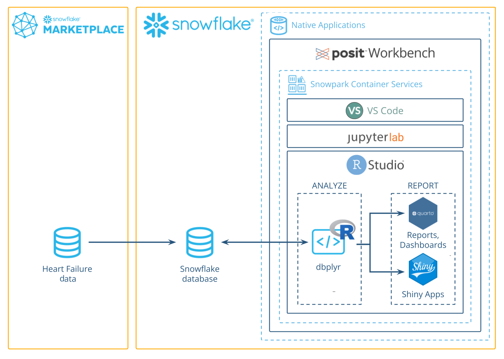

### What You'll Need

- Familiarity with R
- The ability to launch Posit Workbench from Snowflake Native Applications. This can be provided by an administrator with the `accountadmin` role.

### What You’ll Learn

- How to create an R session within the RStudio Pro IDE that comes with the Posit Workbench Native App.
- How to connect to your Snowflake data from R to create tables, visualizations, and more.

### What You’ll Build

- An RStudio Pro IDE environment to use within Snowflake.
- A Quarto document that contains plots and tables built with R, using data stored in Snowflake.
- An interactive Shiny Application built with R, using data stored in Snowflake.

Along the way, you will use R to analyze which variables are associated with the survival patients with heart failure.
You can follow along with this quickstart guide,
or look at the materials provided in the accompanying repository:
<https://github.com/posit-dev/snowflake-posit-quickstart-r>.

## Setup
Duration: 3

Before we begin there are a few components we need to prepare. We need to:

- Add the heart failure data to Snowflake
- Launch the Posit Workbench Native App
- Create an RStudio Pro IDE session
- Install R Packages

### Add the heart failure data to Snowflake

For this analysis, we will use the [Heart Failure Clinical Records](https://archive.ics.uci.edu/dataset/519/heart+failure+clinical+records) dataset. The data is available for download as a CSV from the [UCI Machine Learning Repository](https://archive.ics.uci.edu/dataset/519/heart+failure+clinical+records). You can also access the data from this [S3 bucket](s3://heart-failure-records/heart_failure.csv).

We'll walk through how to download the data from UCI and then upload it to Snowflake from a CSV.

> **_INTERACTIVITY NOTE:_** If you have the necessary permissions in Snowflake, you can also import the data from the [S3 bucket](s3://heart-failure-records/heart_failure.csv).

#### Step 1: Download the data as a CSV

Download the data from UCI [here](https://archive.ics.uci.edu/dataset/519/heart+failure+clinical+records), and then unzip the downloaded file. 

#### Step 2: Add data in Snowsight

Log into [Snowsight](https://docs.snowflake.com/en/user-guide/ui-snowsight), then click `Create` > `Add Data`. You can find the `Create` button in the upper-left corner. 


#### Step 3: Load data

Choose the `Load Data into a Table` option, then select your downloaded heart failure CSV. Specify an existing database or create a new one for the heart failure data. Then, select `+ Create a new table` and name it `HEART_FAILURE`.

Once your find the database, you can load it into your Snowflake account by clicking the Get button on the right-hand side.

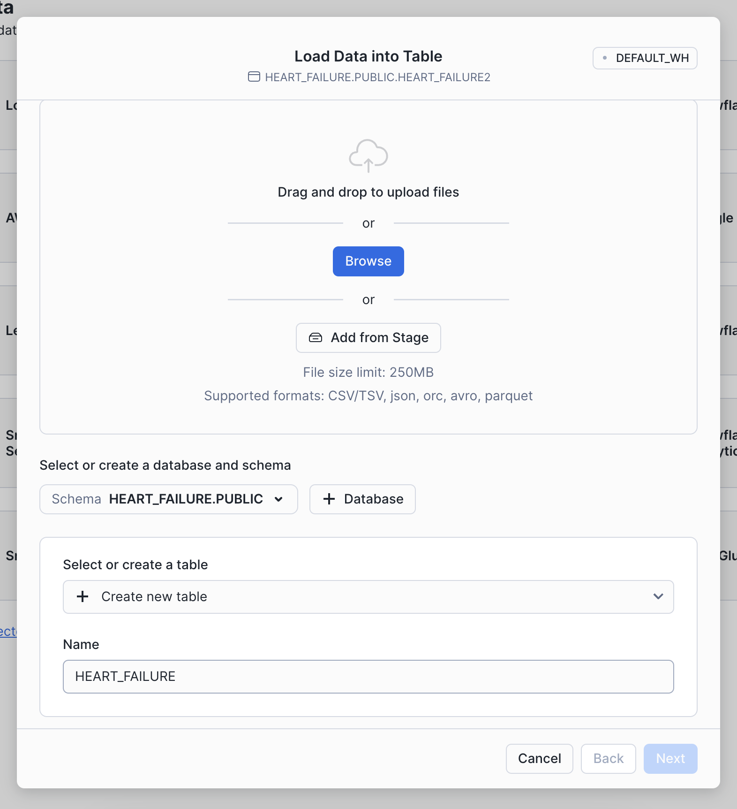

#### Step 4: Confirm data

You should now be able to see the heart failure data in Snowsight. Navigate to `Data` > `Databases`, then select the database to which you added the data (e.g., `HEART_FAILURE`). Expand the database, schema, and tables until you see the `HEART_FAILURE` table. 

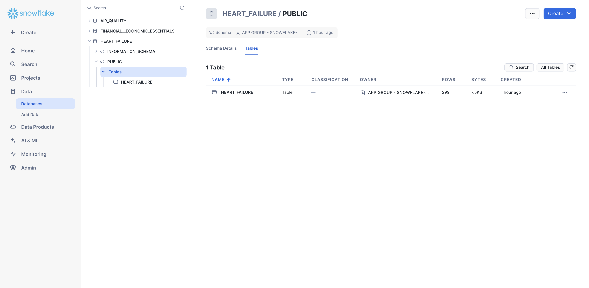

### Launch Posit Workbench

We can then start our data exploration using Posit Workbench.
You can find Posit Workbench as a Snowflake Native Application,
and use it to connect to your database.

#### Step 1: Navigate to Apps

In your Snowflake account, Go to `Data Products` > `Apps` to open the Native Apps collection. If Posit Workbench is not already installed, click `Get`.


#### Step 2: Open the Posit Workbench Native App

Once Posit Workbench is installed, click on the app under `Installed Apps` to launch the app. If you do not see the Posit Workbench app listed, ask you Snowflake account administrator for access to the app.


After clicking on the app, you will see a page with configuration instructions and a blue `Launch app` button.

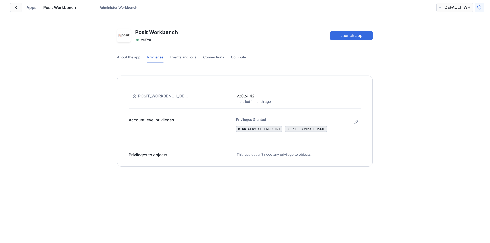

Click on `Launch app`. This should take you to the webpage generated for the Workbench application. You may be prompted to first login to Snowflake using your regular credentials or authentication method.

### Create an RStudio Pro Session 

Posit Workbench provides several IDEs, such as RStudio Pro, JupyterLab, and VS Code. For this analysis we will use an RStudio Pro IDE.

#### Step 1: New Session

Within Posit Workbench, click `New Session` to launch a new session to spin up your coding environment.


#### Step 2: Select an IDE

When prompted, select the RStudio Pro IDE.


#### Step 3: Log into your Snowflake account

Next, connect to your Snowflake account from within Posit Workbench.
Under `Credentials`, click the button with the Snowflake icon to sign in to Snowflake.
Follow the sign in prompts.


When you're successfully signed into Snowflake, the Snowflake button will turn blue
and there will be a checkmark in the upper-left corner.


#### Step 4: Launch the RStudio Pro IDE

Click `Start Session` to launch the RStudio Pro IDE.

Once everything is ready,
you will be able to work with your Snowflake data
in the familiar RStudio Pro IDE. Since the IDE is provided by the Posit Workbench Native App, 
your entire analysis will occur securely within Snowflake.


#### Step 5: Access the Quickstart Materials

This Quickstart will step you through the analysis contained in <https://github.com/posit-dev/snowflake-posit-quickstart-r/blob/main/quarto.qmd>.
To follow along, open the file in your RStudio Pro IDE. You could do this by:

1. **Simple copy-and-paste** Go to File > New File > Quarto Document and then copy the contents of [quarto.qmd](https://github.com/posit-dev/snowflake-posit-quickstart-r/quarto.qmd) into your new file.
2. **Starting a new project linked to the github repo.** To do this:

    1.  Go to File > New Project in the RStudio IDE menu bar.

    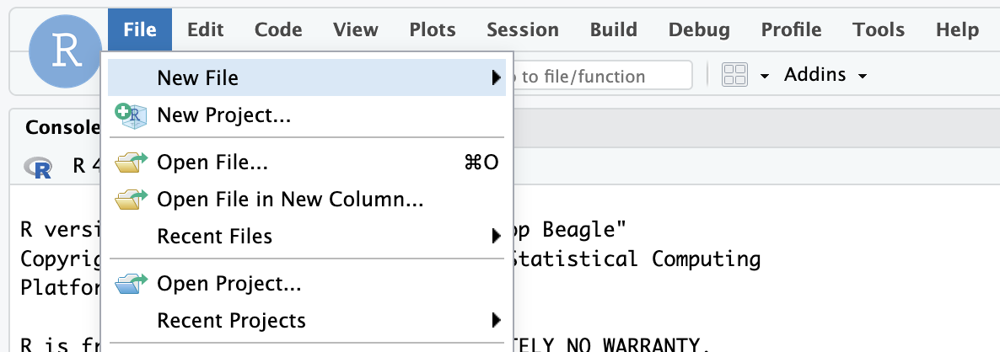

    2.  Select Version Control in the New Project Wizard

    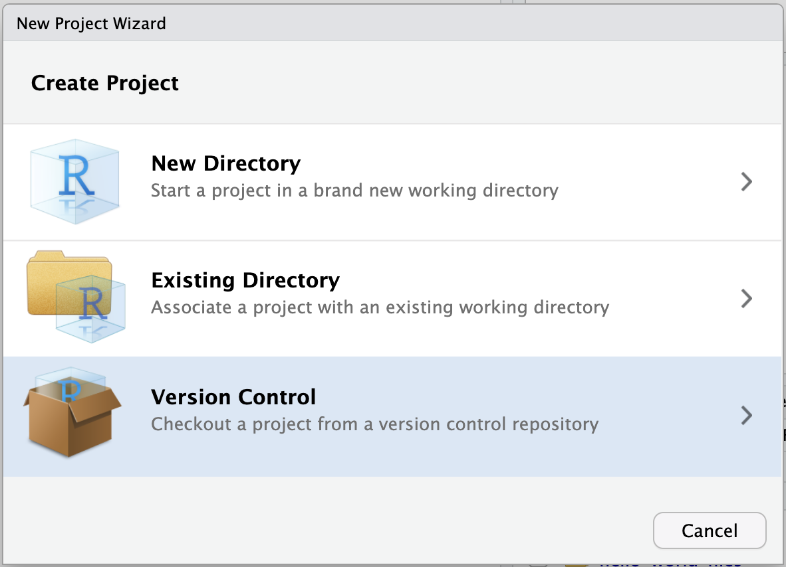

    3.  Select Git

    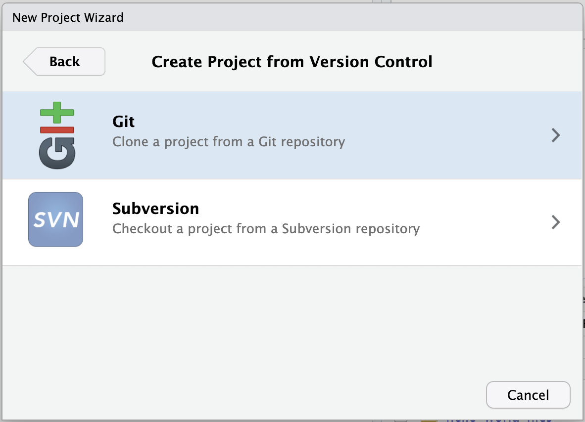

    4.  Paste the [URL](https://github.com/posit-dev/snowflake-posit-quickstart-r/) of the github repo and click Create Project

    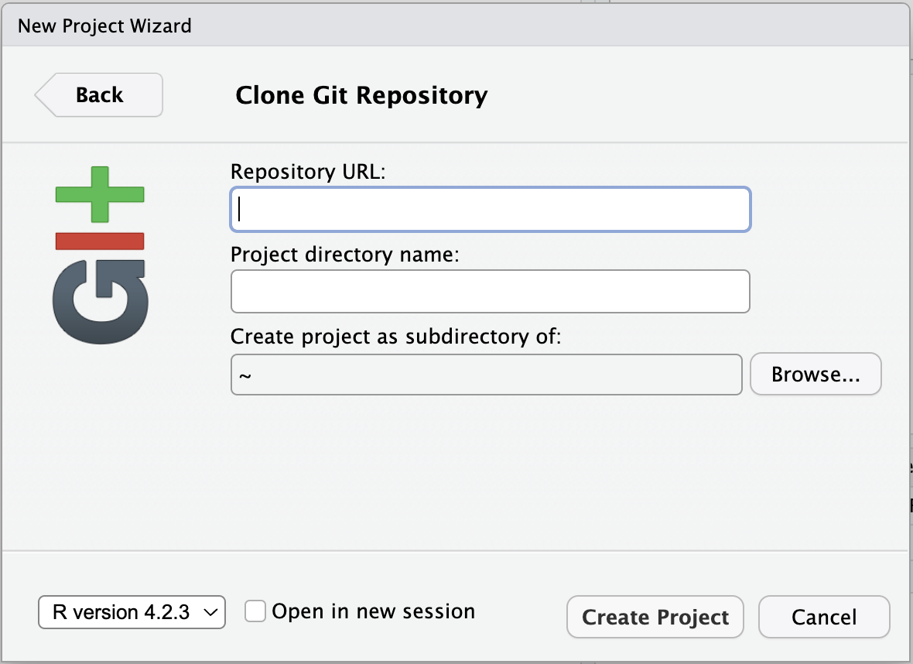

    RStudio will clone a local copy of the materials on github. You can use the Files pane in the bottom right-hand corner of the IDE to navigate to `quarto.qmd`. Click on the file to open it.


### Install R Packages

Now that we're in a familiar R environment,
we need to prepare the packages we will use. For this analysis, we will use the [Tidyverse](https://www.tidyverse.org/) suite of packages, as well as a few others.

```r
install.packages(c("tidyverse", "DBI", "dbplyr", "gt", "gtExtras", "odbc"))
```

<!--
We will also use the development version of the `{odbc}` package to connect to the Snowflake database.

```r
install.packages("pak")
pak::pak("r-dbi/odbc")
```


-->

After we install the packages, we load them.

```r
library(tidyverse)
library(DBI)
library(dbplyr)
library(gt)
library(gtExtras)
library(odbc)
```

## Access Snowflake data from R
Duration: 5

We will run our code in the R environment created by the RStudio Pro IDE, but the code will use data stored in our database on Snowflake.

To access this data, we will use the `{DBI}` and `{odbc}` R packages to connect to the database. We will then use `{dplyr}` and `{dbplyr}` to query the data with R,
without having to write raw SQL. Let's take a look at how this works.

### Connect with `{DBI}`

`{DBI}` is an a R package that allows us to connect to databases with `DBI::dbConnect()`.

To connect to our Snowflake database, we will use a driver provided by the `{odbc}` package. We will need to provide a `warehouse` for compute, and a `database` to connect to.
We can also provide a `schema` here to make connecting to specific tables and views easier.

```r
# Connect to the database
conn <-
  DBI::dbConnect(
    odbc::snowflake(),
    warehouse = "DEFAULT_WH",
    database = "HEART_FAILURE",
    schema = "PUBLIC"
  )
```

We will save our connection as an object, named `conn`, which will make it easy to use.

Once we build a connection, we can see the databases, schemas, and tables available to us in the RStudio IDE Connections pane. Click on the database icon to the right of a database to see its schemas. Click on the schema icon to the right of a schema to see its tables. Click on the table icon to the right of a table to see a preview of the table.

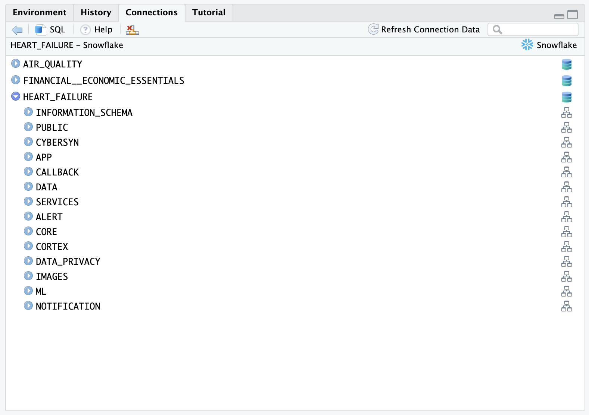

### Create `tbl`s that correspond to tables in the database

Once we build a connection, we can use `dplyr::tbl()` to create `tbl`s. A tbl is an R object that represents a table or view accessed through a connection.


```r
heart_failure <- tbl(conn, "HEART_FAILURE")
```

> If we did not provide the `schema` argument into `DBI::dbConnect()` earlier, we would need to specify the view with `tbl(conn, in_schema("PUBLIC", "HEART_FAILURE"))`.

### Rely on `{dbplyr}` to translate R to SQL

We can now use `heart_failure` as if it was a tibble in R. For example, we can filter rows and select columns from our data.

```r
heart_failure_young <-
  heart_failure |> 
  filter(age < 50) |>
  select(age, sex, smoking, death_event)
```

When we use `tbl`s, `{dbplyr}` translates our R code into SQL queries. Think of any object made downstream from a tbl like a view: it contains SQL that represents a table built from the tbl. If we want to see the SQL code that `{dbplyr}` generates, we can run `dbplyr::show_query()`.

```r
heart_failure_young |>
  show_query()
```
```
SELECT
  "AGE" AS "age",
  "SEX" AS "sex",
  "SMOKING" AS "smoking",
  "DEATH_EVENT" AS "death_event"
FROM "HEART_FAILURE"
WHERE ("AGE" < 50.0)
```

To save compute, R waits to execute a query until we request the data that it represents.

To save memory, R stores the data as a temporary file in the database (instead of in R's global environment). When we inspect the data, R only returns the first few rows of this file to display.

```r
heart_failure_young
```
```
# Source:   SQL [?? x 4]
# Database: Snowflake 8.39.2[@Snowflake/HEART_FAILURE]
     age   sex smoking death_event
   <dbl> <dbl>   <dbl>       <dbl>
 1    45     1       0           1
 2    49     0       0           0
 3    45     1       0           1
 4    48     0       0           1
 5    49     1       1           1
 6    45     1       0           1
 7    45     1       0           1
 8    45     0       0           0
 9    42     0       0           1
10    41     1       1           0
# ℹ more rows
# ℹ Use `print(n = ...)` to see more rows
```

### `collect()`

We can trigger R to execute a query and to return the _entire_ result as a tibble with `dbplyr::collect()`. Keep in mind, that if your result is large, you may not want to collect it into R.

```r
heart_failure_young_df <-
  heart_failure_young |> 
  collect()
  
heart_failure_young_df
```
```
# A tibble: 47 × 4
     age   sex smoking death_event
   <dbl> <dbl>   <dbl>       <dbl>
 1    45     1       0           1
 2    49     0       0           0
 3    45     1       0           1
 4    48     0       0           1
 5    49     1       1           1
 6    45     1       0           1
 7    45     1       0           1
 8    45     0       0           0
 9    42     0       0           1
10    41     1       1           0
# ℹ 37 more rows
# ℹ Use `print(n = ...)` to see more rows
```

### In summary

This system:

1. Keeps our data in the database, saving memory in the R session
2. Pushes computations to the database, saving compute in the R session
3. Evaluates queries lazily, saving compute in the database

We don't need to manage the process, it happens automatically behind the scenes.

> `{dbplyr}` can translate the most common tidyverse and base R functions to SQL. However, you may sometimes use a function that `{dbplyr}` does not recognize or for which there is no SQL analogue. On these occasions, you will need to `collect()` your data into R, where you can process it as a real tibble.

Learn more about `{dbplyr}` at [dbplyr.tidyverse.org](https://dbplyr.tidyverse.org/)

## Write to a Snowflake database
Duration: 1

You can also use `{DBI}` to create a new table in a database or append to an existing table.

To add a new table, use `DBI::dbWriteTable()`. Note that `value` needs to be a data.frame or tibble, which
is why we passed `heart_failure_young_df`, the result of calling `collect()` on `heart_failure_young`.

```r
dbWriteTable(conn, name = "HEART_FAILURE_YOUNG", value = heart_failure_young_df)
```

To append to an existing table, specify `append = TRUE`. If appending, `name` should specify an existing table.

Now that we understand how R will interact with the database, we can use R to perform our analysis.

## Prepare data with `{dplyr}`
Duration: 5

We want to understand which variables in `HEART_FAILURE` are associated with survival
of patients with heart failure.

First we convert the column names to lowercase, so we won't need to worry about capitalization.

```r
# Standardize column names
heart_failure <- 
  heart_failure |> 
  rename_with(str_to_lower)
```

> When we are running these commands on a database connection, `{dbplyr}` is translating the code into SQL for us under the hood.
> We don't need to write raw SQL commands, and the compute is happening directly on the database.
> You can pipe `|>` the code into `show_query()` if you want to see the generated SQL query.


### Filter ages

For now, we'll focus on just patients younger than 50. We also reduce the data to just the columns we are interested in.

```r
heart_failure <-
  heart_failure |> 
  filter(age < 50) |> 
  select(age, diabetes, serum_sodium, serum_creatinine, sex, death_event)
```

Our table now looks like this.

```
# Source:   SQL [?? x 6]
# Database: Snowflake 8.39.2[@Snowflake/HEART_FAILURE]
     age diabetes serum_sodium serum_creatinine   sex death_event
   <dbl>    <dbl>        <dbl>            <dbl> <dbl>       <dbl>
 1    45        0          137             1.1      1           1
 2    49        0          138             1        0           0
 3    45        0          127             0.8      1           1
 4    48        1          121             1.9      0           1
 5    49        0          136             1.1      1           1
 6    45        1          139             1        1           1
 7    45        0          145             1        1           1
 8    45        0          137             1.18     0           0
 9    42        1          136             1.3      0           1
10    41        0          140             0.8      1           0
# ℹ more rows
# ℹ Use `print(n = ...)` to see more rows
```

## Visualize Data with `{ggplot2}`
Duration: 5

The heart failure data provides important insights that can help us:

- Identify factors associated with increased risk of mortality after heart failure
- Predict future survival outcomes based on historical clinical data
- Benchmark patient outcomes based on clinical indicators like serum sodium levels

Visualizing clinical variables across different patient groups can help identify patterns.

### Visualize serum sodium levels

We can use `{ggplot2}` to visually compare serum sodium levels across different patient groups. In this plot, we see the distribution of serum sodium based on whether the patients have diabetes and whether they survived (`0`) or died (`1`) during the follow-up period.

```r
heart_failure |> 
  mutate(
    death_event = as.character(death_event), 
    diabetes = as.character(diabetes)
  ) |> 
  ggplot(aes(x = death_event, y = serum_sodium, fill = diabetes)) +
  geom_boxplot() +
  labs(
    title = "Serum Sodium Levels by Diabetes Status and Survival Outcome",
    x = "Survival Outcome (0 = Survived, 1 = Died)",
    y = "Serum Sodium (mEq/L)",
    fill = "Diabetes"
  ) +
  theme(legend.position = "bottom")
```

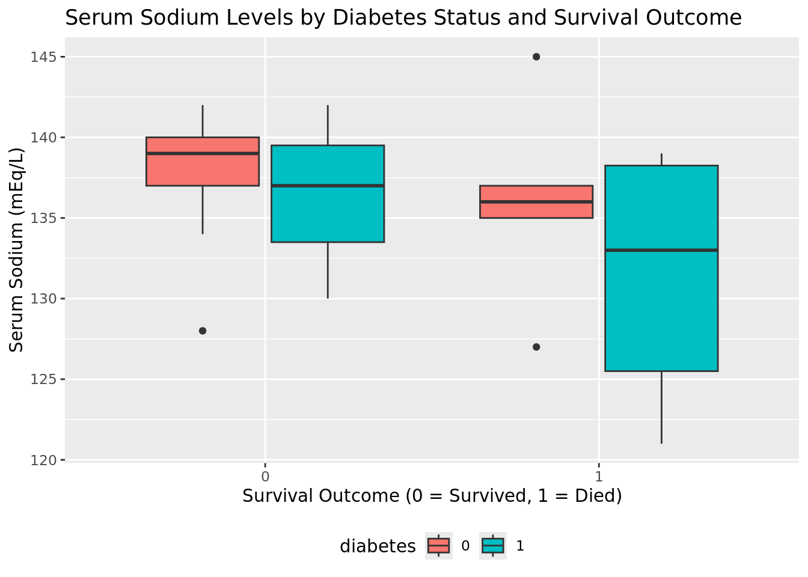

> **_INTERACTIVITY NOTE:_**  The code above allows for easy visualization of other variables. You can adjust the `aes()` function or filter the data to explore different clinical indicators and patient characteristics.

## Make publication-ready tables with `{gt}`
Duration: 5

We can continue exploring the heart failure dataset with visualizations or create a table that concisely displays multiple pieces of information at once. For example, we can use `{dplyr}` verbs to calculate the median values for various clinical metrics across different patient groups.

```r
heart_failure |> 
  summarize(
    across(
      c("age", "serum_creatinine", "serum_sodium"), 
      \(x) median(x, na.rm = TRUE), 
      .names = "median_{.col}"
    )
  )
```

```
# Source:   SQL [1 x 3]
# Database: Snowflake 8.39.2[@Snowflake/HEART_FAILURE]
  median_age median_serum_creatinine median_serum_sodium
       <dbl>                   <dbl>               <dbl>
1         45                       1                 137
```

With `{dplyr}`'s `group_by()` command, we can compute separate metrics for each
combination of `death_event` and `diabetes`.

```r
comparison <- 
  heart_failure |> 
  group_by(death_event, diabetes) |> 
  summarize(
    median_age = median(age, na.rm = TRUE),
    median_serum_creatinine = median(serum_creatinine, na.rm = TRUE),
    median_serum_sodium = median(serum_sodium, na.rm = TRUE),
    .groups = "drop"
  )
  
comparison
```

```
# Source:   SQL [4 x 5]
# Database: Snowflake 8.39.2[@Snowflake/HEART_FAILURE]
  death_event diabetes median_age median_serum_creatinine median_serum_sodium
        <dbl>    <dbl>      <dbl>                   <dbl>               <dbl>
1           0        0       42                      1                    139
2           1        1       45.5                    1.45                 133
3           1        0       45                      1.1                  136
4           0        1       45                      0.9                  137
```

This is a useful way to examine the information for ourselves. However, if we wish to share the information with others, we might prefer to present the table in a more polished format. We can do this with commands from R's [`{gt}` package](https://gt.rstudio.com/).

The following code creates a table displaying the information in `comparison`.

```r
comparison |> 
  mutate(
    death_event = case_when(
      death_event == 1 ~ "Died",
      death_event == 0 ~ "Survived"
    ),
    diabetes = case_when(
      diabetes == 1 ~ "Yes",
      diabetes == 0 ~ "No"
    )
  ) |> 
  arrange(desc(death_event), desc(diabetes)) |> 
  gt(rowname_col = "death_event") |> 
  fmt_number(decimals = 1) |> 
  cols_label(
    diabetes = "Diabetes Status",
    median_age = "Median Age",
    median_serum_creatinine = "Median Serum Creatinine (mg/dL)",
    median_serum_sodium = "Median Serum Sodium (mEq/L)"
  ) |> 
  tab_header(
    title = "Clinical Metrics by Survival Outcome and Diabetes Status"
  ) |> 
  data_color(
    columns = c(median_serum_creatinine, median_serum_sodium),
    palette = "Blues"
  ) |> 
  tab_style(
    style = cell_text(weight = "bold"),
    locations = cells_row_groups(groups = everything())
  )
```

<div id="tbjpczuppu" style="padding-left:0px;padding-right:0px;padding-top:10px;padding-bottom:10px;overflow-x:auto;overflow-y:auto;width:auto;height:auto;">
  
  <table class="gt_table" data-quarto-disable-processing="false" data-quarto-bootstrap="false" style="-webkit-font-smoothing: antialiased; -moz-osx-font-smoothing: grayscale; font-family: system-ui, 'Segoe UI', Roboto, Helvetica, Arial, sans-serif, 'Apple Color Emoji', 'Segoe UI Emoji', 'Segoe UI Symbol', 'Noto Color Emoji'; display: table; border-collapse: collapse; line-height: normal; margin-left: auto; margin-right: auto; color: #333333; font-size: 16px; font-weight: normal; font-style: normal; background-color: #FFFFFF; width: auto; border-top-style: solid; border-top-width: 2px; border-top-color: #A8A8A8; border-right-style: none; border-right-width: 2px; border-right-color: #D3D3D3; border-bottom-style: solid; border-bottom-width: 2px; border-bottom-color: #A8A8A8; border-left-style: none; border-left-width: 2px; border-left-color: #D3D3D3;" bgcolor="#FFFFFF">
  <thead style="border-style: none;">
    <tr class="gt_heading" style="border-style: none; background-color: #FFFFFF; text-align: center; border-bottom-color: #FFFFFF; border-left-style: none; border-left-width: 1px; border-left-color: #D3D3D3; border-right-style: none; border-right-width: 1px; border-right-color: #D3D3D3;" bgcolor="#FFFFFF" align="center">
      <td colspan="5" class="gt_heading gt_title gt_font_normal gt_bottom_border" style="border-style: none; color: #333333; font-size: 125%; padding-top: 4px; padding-bottom: 4px; padding-left: 5px; padding-right: 5px; background-color: #FFFFFF; text-align: center; border-left-style: none; border-left-width: 1px; border-left-color: #D3D3D3; border-right-style: none; border-right-width: 1px; border-right-color: #D3D3D3; border-bottom-style: solid; border-bottom-width: 2px; border-bottom-color: #D3D3D3; font-weight: normal;" bgcolor="#FFFFFF" align="center">Clinical Metrics by Survival Outcome and Diabetes Status</td>
    </tr>
    
    <tr class="gt_col_headings" style="border-style: none; border-top-style: solid; border-top-width: 2px; border-top-color: #D3D3D3; border-bottom-style: solid; border-bottom-width: 2px; border-bottom-color: #D3D3D3; border-left-style: none; border-left-width: 1px; border-left-color: #D3D3D3; border-right-style: none; border-right-width: 1px; border-right-color: #D3D3D3;">
      <th class="gt_col_heading gt_columns_bottom_border gt_left" rowspan="1" colspan="1" scope="col" id="a::stub" style="border-style: none; color: #333333; background-color: #FFFFFF; font-size: 100%; font-weight: normal; text-transform: inherit; border-left-style: none; border-left-width: 1px; border-left-color: #D3D3D3; border-right-style: none; border-right-width: 1px; border-right-color: #D3D3D3; vertical-align: bottom; padding-top: 5px; padding-bottom: 6px; padding-left: 5px; padding-right: 5px; overflow-x: hidden; text-align: left;" bgcolor="#FFFFFF" valign="bottom" align="left"></th>
      <th class="gt_col_heading gt_columns_bottom_border gt_left" rowspan="1" colspan="1" scope="col" id="diabetes" style="border-style: none; color: #333333; background-color: #FFFFFF; font-size: 100%; font-weight: normal; text-transform: inherit; border-left-style: none; border-left-width: 1px; border-left-color: #D3D3D3; border-right-style: none; border-right-width: 1px; border-right-color: #D3D3D3; vertical-align: bottom; padding-top: 5px; padding-bottom: 6px; padding-left: 5px; padding-right: 5px; overflow-x: hidden; text-align: left;" bgcolor="#FFFFFF" valign="bottom" align="left">Diabetes Status</th>
      <th class="gt_col_heading gt_columns_bottom_border gt_right" rowspan="1" colspan="1" scope="col" id="median_age" style="border-style: none; color: #333333; background-color: #FFFFFF; font-size: 100%; font-weight: normal; text-transform: inherit; border-left-style: none; border-left-width: 1px; border-left-color: #D3D3D3; border-right-style: none; border-right-width: 1px; border-right-color: #D3D3D3; vertical-align: bottom; padding-top: 5px; padding-bottom: 6px; padding-left: 5px; padding-right: 5px; overflow-x: hidden; text-align: right; font-variant-numeric: tabular-nums;" bgcolor="#FFFFFF" valign="bottom" align="right">Median Age</th>
      <th class="gt_col_heading gt_columns_bottom_border gt_right" rowspan="1" colspan="1" scope="col" id="median_serum_creatinine" style="border-style: none; color: #333333; background-color: #FFFFFF; font-size: 100%; font-weight: normal; text-transform: inherit; border-left-style: none; border-left-width: 1px; border-left-color: #D3D3D3; border-right-style: none; border-right-width: 1px; border-right-color: #D3D3D3; vertical-align: bottom; padding-top: 5px; padding-bottom: 6px; padding-left: 5px; padding-right: 5px; overflow-x: hidden; text-align: right; font-variant-numeric: tabular-nums;" bgcolor="#FFFFFF" valign="bottom" align="right">Median Serum Creatinine (mg/dL)</th>
      <th class="gt_col_heading gt_columns_bottom_border gt_right" rowspan="1" colspan="1" scope="col" id="median_serum_sodium" style="border-style: none; color: #333333; background-color: #FFFFFF; font-size: 100%; font-weight: normal; text-transform: inherit; border-left-style: none; border-left-width: 1px; border-left-color: #D3D3D3; border-right-style: none; border-right-width: 1px; border-right-color: #D3D3D3; vertical-align: bottom; padding-top: 5px; padding-bottom: 6px; padding-left: 5px; padding-right: 5px; overflow-x: hidden; text-align: right; font-variant-numeric: tabular-nums;" bgcolor="#FFFFFF" valign="bottom" align="right">Median Serum Sodium (mEq/L)</th>
    </tr>
  </thead>
  <tbody class="gt_table_body" style="border-style: none; border-top-style: solid; border-top-width: 2px; border-top-color: #D3D3D3; border-bottom-style: solid; border-bottom-width: 2px; border-bottom-color: #D3D3D3;">
    <tr style="border-style: none;"><th id="stub_1_1" scope="row" class="gt_row gt_left gt_stub" style="border-style: none; padding-top: 8px; padding-bottom: 8px; margin: 10px; border-top-style: solid; border-top-width: 1px; border-top-color: #D3D3D3; border-left-style: none; border-left-width: 1px; border-left-color: #D3D3D3; vertical-align: middle; overflow-x: hidden; color: #333333; background-color: #FFFFFF; font-size: 100%; font-weight: initial; text-transform: inherit; border-right-style: solid; border-right-width: 2px; border-right-color: #D3D3D3; padding-left: 5px; padding-right: 5px; text-align: left;" valign="middle" bgcolor="#FFFFFF" align="left">Survived</th>
<td headers="stub_1_1 diabetes" class="gt_row gt_left" style="border-style: none; padding-top: 8px; padding-bottom: 8px; padding-left: 5px; padding-right: 5px; margin: 10px; border-top-style: solid; border-top-width: 1px; border-top-color: #D3D3D3; border-left-style: none; border-left-width: 1px; border-left-color: #D3D3D3; border-right-style: none; border-right-width: 1px; border-right-color: #D3D3D3; vertical-align: middle; overflow-x: hidden; text-align: left;" valign="middle" align="left">Yes</td>
<td headers="stub_1_1 median_age" class="gt_row gt_right" style="border-style: none; padding-top: 8px; padding-bottom: 8px; padding-left: 5px; padding-right: 5px; margin: 10px; border-top-style: solid; border-top-width: 1px; border-top-color: #D3D3D3; border-left-style: none; border-left-width: 1px; border-left-color: #D3D3D3; border-right-style: none; border-right-width: 1px; border-right-color: #D3D3D3; vertical-align: middle; overflow-x: hidden; text-align: right; font-variant-numeric: tabular-nums;" valign="middle" align="right">45.0</td>
<td headers="stub_1_1 median_serum_creatinine" class="gt_row gt_right" style="border-style: none; padding-top: 8px; padding-bottom: 8px; padding-left: 5px; padding-right: 5px; margin: 10px; border-top-style: solid; border-top-width: 1px; border-top-color: #D3D3D3; border-left-style: none; border-left-width: 1px; border-left-color: #D3D3D3; border-right-style: none; border-right-width: 1px; border-right-color: #D3D3D3; vertical-align: middle; overflow-x: hidden; text-align: right; font-variant-numeric: tabular-nums; background-color: #F7FBFF; color: #000000;" bgcolor="#F7FBFF" valign="middle" align="right">0.9</td>
<td headers="stub_1_1 median_serum_sodium" class="gt_row gt_right" style="border-style: none; padding-top: 8px; padding-bottom: 8px; padding-left: 5px; padding-right: 5px; margin: 10px; border-top-style: solid; border-top-width: 1px; border-top-color: #D3D3D3; border-left-style: none; border-left-width: 1px; border-left-color: #D3D3D3; border-right-style: none; border-right-width: 1px; border-right-color: #D3D3D3; vertical-align: middle; overflow-x: hidden; text-align: right; font-variant-numeric: tabular-nums; background-color: #3987C0; color: #FFFFFF;" bgcolor="#3987C0" valign="middle" align="right">137.0</td></tr>
    <tr style="border-style: none;"><th id="stub_1_2" scope="row" class="gt_row gt_left gt_stub" style="border-style: none; padding-top: 8px; padding-bottom: 8px; margin: 10px; border-top-style: solid; border-top-width: 1px; border-top-color: #D3D3D3; border-left-style: none; border-left-width: 1px; border-left-color: #D3D3D3; vertical-align: middle; overflow-x: hidden; color: #333333; background-color: #FFFFFF; font-size: 100%; font-weight: initial; text-transform: inherit; border-right-style: solid; border-right-width: 2px; border-right-color: #D3D3D3; padding-left: 5px; padding-right: 5px; text-align: left;" valign="middle" bgcolor="#FFFFFF" align="left">Survived</th>
<td headers="stub_1_2 diabetes" class="gt_row gt_left" style="border-style: none; padding-top: 8px; padding-bottom: 8px; padding-left: 5px; padding-right: 5px; margin: 10px; border-top-style: solid; border-top-width: 1px; border-top-color: #D3D3D3; border-left-style: none; border-left-width: 1px; border-left-color: #D3D3D3; border-right-style: none; border-right-width: 1px; border-right-color: #D3D3D3; vertical-align: middle; overflow-x: hidden; text-align: left;" valign="middle" align="left">No</td>
<td headers="stub_1_2 median_age" class="gt_row gt_right" style="border-style: none; padding-top: 8px; padding-bottom: 8px; padding-left: 5px; padding-right: 5px; margin: 10px; border-top-style: solid; border-top-width: 1px; border-top-color: #D3D3D3; border-left-style: none; border-left-width: 1px; border-left-color: #D3D3D3; border-right-style: none; border-right-width: 1px; border-right-color: #D3D3D3; vertical-align: middle; overflow-x: hidden; text-align: right; font-variant-numeric: tabular-nums;" valign="middle" align="right">42.0</td>
<td headers="stub_1_2 median_serum_creatinine" class="gt_row gt_right" style="border-style: none; padding-top: 8px; padding-bottom: 8px; padding-left: 5px; padding-right: 5px; margin: 10px; border-top-style: solid; border-top-width: 1px; border-top-color: #D3D3D3; border-left-style: none; border-left-width: 1px; border-left-color: #D3D3D3; border-right-style: none; border-right-width: 1px; border-right-color: #D3D3D3; vertical-align: middle; overflow-x: hidden; text-align: right; font-variant-numeric: tabular-nums; background-color: #D3E4F3; color: #000000;" bgcolor="#D3E4F3" valign="middle" align="right">1.0</td>
<td headers="stub_1_2 median_serum_sodium" class="gt_row gt_right" style="border-style: none; padding-top: 8px; padding-bottom: 8px; padding-left: 5px; padding-right: 5px; margin: 10px; border-top-style: solid; border-top-width: 1px; border-top-color: #D3D3D3; border-left-style: none; border-left-width: 1px; border-left-color: #D3D3D3; border-right-style: none; border-right-width: 1px; border-right-color: #D3D3D3; vertical-align: middle; overflow-x: hidden; text-align: right; font-variant-numeric: tabular-nums; background-color: #08306B; color: #FFFFFF;" bgcolor="#08306B" valign="middle" align="right">139.0</td></tr>
    <tr style="border-style: none;"><th id="stub_1_3" scope="row" class="gt_row gt_left gt_stub" style="border-style: none; padding-top: 8px; padding-bottom: 8px; margin: 10px; border-top-style: solid; border-top-width: 1px; border-top-color: #D3D3D3; border-left-style: none; border-left-width: 1px; border-left-color: #D3D3D3; vertical-align: middle; overflow-x: hidden; color: #333333; background-color: #FFFFFF; font-size: 100%; font-weight: initial; text-transform: inherit; border-right-style: solid; border-right-width: 2px; border-right-color: #D3D3D3; padding-left: 5px; padding-right: 5px; text-align: left;" valign="middle" bgcolor="#FFFFFF" align="left">Died</th>
<td headers="stub_1_3 diabetes" class="gt_row gt_left" style="border-style: none; padding-top: 8px; padding-bottom: 8px; padding-left: 5px; padding-right: 5px; margin: 10px; border-top-style: solid; border-top-width: 1px; border-top-color: #D3D3D3; border-left-style: none; border-left-width: 1px; border-left-color: #D3D3D3; border-right-style: none; border-right-width: 1px; border-right-color: #D3D3D3; vertical-align: middle; overflow-x: hidden; text-align: left;" valign="middle" align="left">Yes</td>
<td headers="stub_1_3 median_age" class="gt_row gt_right" style="border-style: none; padding-top: 8px; padding-bottom: 8px; padding-left: 5px; padding-right: 5px; margin: 10px; border-top-style: solid; border-top-width: 1px; border-top-color: #D3D3D3; border-left-style: none; border-left-width: 1px; border-left-color: #D3D3D3; border-right-style: none; border-right-width: 1px; border-right-color: #D3D3D3; vertical-align: middle; overflow-x: hidden; text-align: right; font-variant-numeric: tabular-nums;" valign="middle" align="right">45.5</td>
<td headers="stub_1_3 median_serum_creatinine" class="gt_row gt_right" style="border-style: none; padding-top: 8px; padding-bottom: 8px; padding-left: 5px; padding-right: 5px; margin: 10px; border-top-style: solid; border-top-width: 1px; border-top-color: #D3D3D3; border-left-style: none; border-left-width: 1px; border-left-color: #D3D3D3; border-right-style: none; border-right-width: 1px; border-right-color: #D3D3D3; vertical-align: middle; overflow-x: hidden; text-align: right; font-variant-numeric: tabular-nums; background-color: #08306B; color: #FFFFFF;" bgcolor="#08306B" valign="middle" align="right">1.5</td>
<td headers="stub_1_3 median_serum_sodium" class="gt_row gt_right" style="border-style: none; padding-top: 8px; padding-bottom: 8px; padding-left: 5px; padding-right: 5px; margin: 10px; border-top-style: solid; border-top-width: 1px; border-top-color: #D3D3D3; border-left-style: none; border-left-width: 1px; border-left-color: #D3D3D3; border-right-style: none; border-right-width: 1px; border-right-color: #D3D3D3; vertical-align: middle; overflow-x: hidden; text-align: right; font-variant-numeric: tabular-nums; background-color: #F7FBFF; color: #000000;" bgcolor="#F7FBFF" valign="middle" align="right">133.0</td></tr>
    <tr style="border-style: none;"><th id="stub_1_4" scope="row" class="gt_row gt_left gt_stub" style="border-style: none; padding-top: 8px; padding-bottom: 8px; margin: 10px; border-top-style: solid; border-top-width: 1px; border-top-color: #D3D3D3; border-left-style: none; border-left-width: 1px; border-left-color: #D3D3D3; vertical-align: middle; overflow-x: hidden; color: #333333; background-color: #FFFFFF; font-size: 100%; font-weight: initial; text-transform: inherit; border-right-style: solid; border-right-width: 2px; border-right-color: #D3D3D3; padding-left: 5px; padding-right: 5px; text-align: left;" valign="middle" bgcolor="#FFFFFF" align="left">Died</th>
<td headers="stub_1_4 diabetes" class="gt_row gt_left" style="border-style: none; padding-top: 8px; padding-bottom: 8px; padding-left: 5px; padding-right: 5px; margin: 10px; border-top-style: solid; border-top-width: 1px; border-top-color: #D3D3D3; border-left-style: none; border-left-width: 1px; border-left-color: #D3D3D3; border-right-style: none; border-right-width: 1px; border-right-color: #D3D3D3; vertical-align: middle; overflow-x: hidden; text-align: left;" valign="middle" align="left">No</td>
<td headers="stub_1_4 median_age" class="gt_row gt_right" style="border-style: none; padding-top: 8px; padding-bottom: 8px; padding-left: 5px; padding-right: 5px; margin: 10px; border-top-style: solid; border-top-width: 1px; border-top-color: #D3D3D3; border-left-style: none; border-left-width: 1px; border-left-color: #D3D3D3; border-right-style: none; border-right-width: 1px; border-right-color: #D3D3D3; vertical-align: middle; overflow-x: hidden; text-align: right; font-variant-numeric: tabular-nums;" valign="middle" align="right">45.0</td>
<td headers="stub_1_4 median_serum_creatinine" class="gt_row gt_right" style="border-style: none; padding-top: 8px; padding-bottom: 8px; padding-left: 5px; padding-right: 5px; margin: 10px; border-top-style: solid; border-top-width: 1px; border-top-color: #D3D3D3; border-left-style: none; border-left-width: 1px; border-left-color: #D3D3D3; border-right-style: none; border-right-width: 1px; border-right-color: #D3D3D3; vertical-align: middle; overflow-x: hidden; text-align: right; font-variant-numeric: tabular-nums; background-color: #A2CCE2; color: #000000;" bgcolor="#A2CCE2" valign="middle" align="right">1.1</td>
<td headers="stub_1_4 median_serum_sodium" class="gt_row gt_right" style="border-style: none; padding-top: 8px; padding-bottom: 8px; padding-left: 5px; padding-right: 5px; margin: 10px; border-top-style: solid; border-top-width: 1px; border-top-color: #D3D3D3; border-left-style: none; border-left-width: 1px; border-left-color: #D3D3D3; border-right-style: none; border-right-width: 1px; border-right-color: #D3D3D3; vertical-align: middle; overflow-x: hidden; text-align: right; font-variant-numeric: tabular-nums; background-color: #6BAED6; color: #000000;" bgcolor="#6BAED6" valign="middle" align="right">136.0</td></tr>
  </tbody>
  
  
</table>
</div>

Now that we've accumulated some insights, let's think about how we might present the results of our analysis to our colleagues.

## Build Reports and Dashboards with Quarto
Duration: 2

We've conveniently written our analysis in a Quarto (.qmd) document, [quarto.qmd](https://github.com/posit-dev/snowflake-posit-quickstart-r/blob/main/quarto.qmd). [Quarto](https://quarto.org/)
is an open-source publishing system that makes it easy to create
[data products](https://quarto.org/docs/guide/) such as
[documents](https://quarto.org/docs/output-formats/html-basics.html),
[presentations](https://quarto.org/docs/presentations/),
[dashboards](https://quarto.org/docs/dashboards/),
[websites](https://quarto.org/docs/websites/),
and
[books](https://quarto.org/docs/books/).

By placing our work in a Quarto document, we have interwoven all of our code, results, output, and prose text into a single literate programming document.
This way everything can travel together in a reproducible data product.

A Quarto document can be thought of as a regular markdown document,
but with the ability to run code chunks.

You can run any of the code chunks by clicking the play button above the chunk in the RStudio Pro IDE.


You can render the entire document into a polished report to share, with the `Render` button.


This will run all the code in the document from top to bottom in a new R session,
and generate an HTML file, by default, for you to view and share.

### Learn More about Quarto

You can learn more about Quarto here: <https://quarto.org/>,
and the documentation for all the various Quarto outputs here: <https://quarto.org/docs/guide/>.
Quarto works with R, Python, and Javascript Observable code out-of-the box,
and is a great tool to communicate your data science analyses.


## Shiny Application
Duration: 2

One way to share our work and allow others to explore the heart failure dataset is to create an
interactive [Shiny](https://shiny.posit.co/) app. 

We've prepared an example Shiny app in the directory:
<https://github.com/posit-dev/snowflake-posit-quickstart-r>. Our app allows the user
to explore different clinical metrics in one place.

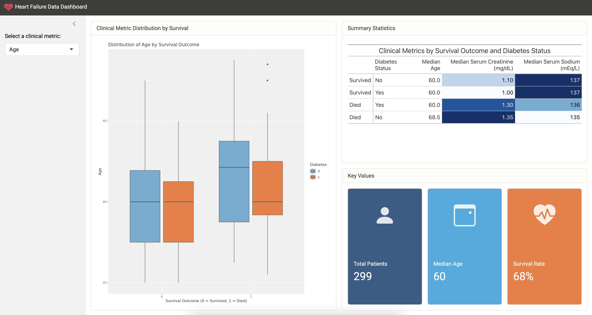

To run the app, open `app.R` and then click the Run App button at the top of the script in the RStudio Pro IDE.


Change the metric in the sidebar to control which metric is plotted.

### Learn More About Shiny

You can learn more about Shiny at: <https://shiny.posit.co/>.
This example uses Shiny for R, but
[Shiny for Python](https://shiny.posit.co/py/)
is also available!

If you're new to Shiny, you can try it online with
[shinylive](https://shinylive.io/).
It too, comes in a [Python](https://shinylive.io/py) version.

## Conclusion and Resources
Duration: 2

R is beloved by data scientists for its intuitive, concise syntax. You can now combine this syntax with the power and peace of mind of Snowflake. The Posit Workbench Native Application provides an IDE for R _within Snowflake_. You can then use R's existing database packages---`{DBI}`, `{odbc}`, `{dbplyr}`---to access your Snowflake databases.

### What You Learned

- How to create an R session within the RStudio Pro IDE that comes with the Posit Workbench Native App.
- How to connect to your Snowflake data from R to create tables, visualizations, and more.
- Build an RStudio Pro IDE environment to use within Snowflake.
- Build a Quarto document that contains plots and tables built with R, using data stored in Snowflake.
- Build an interactive Shiny Application built with R, using data stored in Snowflake.


### Releated Resources

- [Source Code on GitHub](https://github.com/posit-dev/snowflake-posit-quickstart-r)
- [More about Posit Workbench](https://posit.co/products/enterprise/workbench/)
- [{tidyverse} package for data science in R](https://dbplyr.tidyverse.org/)
- [{dbplyr} package for database connections](https://dbplyr.tidyverse.org/)
- [{gt} package for tables](https://gt.rstudio.com/)
- [Quarto for reproducible documents, reports, and data products](https://quarto.org/)
- [Shiny for interactive dashboards and applications](https://shiny.posit.co/)
- [Shinylive for serverless Shiny applications](https://shinylive.io/)